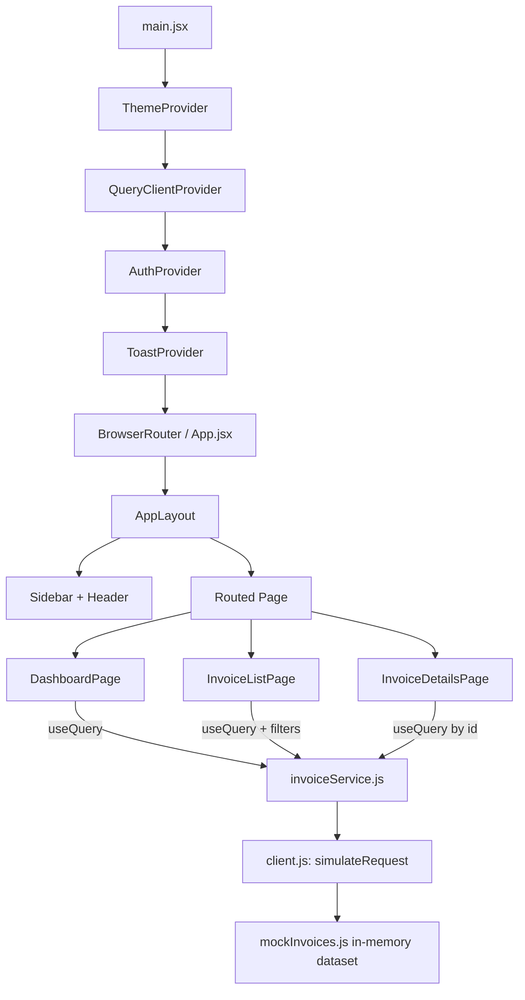

# 📦 FreightFox — Invoice Management System

A modern, role-aware invoice management dashboard built with React. It lets teams create, browse, filter, analyze and export invoices with a polished, light/dark-mode UI backed by a simulated API layer — making it easy to swap in a real backend later.


---

## ✨ Features

### 📊 Dashboard
- KPI cards — total invoices, paid invoices, pending amount, overdue invoices
- **Business Excellence** panel — total revenue collected, average invoice value, collection rate, top client
- **Analytics** charts — revenue trend (area chart), invoice status mix (donut chart), top customers by revenue (bar chart)
- One-click **Add Invoice** menu — create a single invoice via a form, or bulk-import invoices from a JSON file

### 🧾 Invoice Listing
- Sortable, paginated table (click any column header to sort)
- Debounced search across invoice ID, customer name and company
- Filters for **status** and **issue-date range**
- Bulk selection (persists across pages) with CSV export and bulk delete
- Row click navigates to full invoice details

### 📄 Invoice Details
- Invoice summary (billed-to, dates, currency, total)
- Line items table with computed line totals
- Download invoice (plain-text summary) and delete (with confirmation dialog)

### 🔐 Role-Based Access
Switch roles from the header to see the UI adapt in real time:

| Role      | View | Export / Download | Bulk Actions | Delete | Add Invoice |
|-----------|:----:|:------------------:|:------------:|:------:|:------------:|
| Admin     | ✅   | ✅                  | ✅           | ✅     | ✅           |
| Finance   | ✅   | ✅                  | ✅           | ❌     | ✅           |
| Viewer    | ✅   | ❌                  | ❌           | ❌     | ❌           |

### 🎨 UI/UX
- Light & dark theme toggle (persisted to `localStorage`, respects OS preference on first load)
- Toast notifications for success/error feedback
- Confirmation dialogs before destructive actions
- Fully responsive, accessible form controls

---

## 🛠 Tech Stack

| Category            | Technology |
|----------------------|-----------|
| UI Library           | [React 19](https://react.dev/) |
| Build Tool           | [Vite 8](https://vite.dev/) |
| Routing              | [React Router 7](https://reactrouter.com/) |
| Server/Async State   | [TanStack Query 5](https://tanstack.com/query/latest) |
| Styling              | [Tailwind CSS 4](https://tailwindcss.com/) (class-based dark mode) |
| Charts               | [Recharts](https://recharts.org/) |
| Icons                | [lucide-react](https://lucide.dev/) |
| Date utilities        | [date-fns](https://date-fns.org/) |
| Linting              | ESLint 10 (flat config) |

There is no real backend — [`src/api/invoiceService.js`](src/api/invoiceService.js) simulates network latency (`simulateRequest` in [`src/api/client.js`](src/api/client.js)) over an in-memory dataset generated by [`src/data/mockInvoices.js`](src/data/mockInvoices.js). The service layer's function signatures are designed so it can be swapped for real HTTP calls without touching any UI code.

---

## 📁 Project Structure

```
InvoiceManagement/
├─ src/
│  ├─ api/
│  │  ├─ client.js            # simulateRequest() — fake latency/failure wrapper
│  │  └─ invoiceService.js     # fetch/create/delete invoices, dashboard stats & chart data
│  ├─ components/
│  │  ├─ layout/
│  │  │  ├─ AppLayout.jsx      # sidebar + header shell (renders <Outlet/>)
│  │  │  ├─ Sidebar.jsx        # navigation
│  │  │  ├─ Header.jsx         # theme toggle + role switcher
│  │  │  ├─ RoleSwitcher.jsx   # role dropdown menu
│  │  │  └─ AddInvoiceButton.jsx  # hover menu → single / bulk invoice creation
│  │  ├─ Modal.jsx             # generic dialog shell
│  │  ├─ ConfirmDialog.jsx     # yes/cancel confirmation modal
│  │  ├─ SingleInvoiceModal.jsx   # manual invoice creation form
│  │  ├─ BulkInvoiceModal.jsx     # JSON file upload + validation + import
│  │  └─ StatusBadge.jsx       # colored status pill
│  ├─ context/
│  │  ├─ AuthContext.jsx / auth-context.js / useAuth.js     # role & permissions
│  │  ├─ ThemeContext.jsx / theme-context.js / useTheme.js  # light/dark mode
│  │  └─ ToastContext.jsx / toast-context.js / useToast.js  # notifications
│  ├─ data/
│  │  └─ mockInvoices.js       # deterministic seeded mock dataset (130 invoices)
│  ├─ lib/
│  │  ├─ formatters.js         # currency (INR)/date/number formatting
│  │  ├─ download.js           # CSV/text export + JSON template download
│  │  └─ invoiceValidation.js  # shared validation for manual & bulk invoice input
│  ├─ pages/
│  │  ├─ DashboardPage.jsx     # KPIs, business cards, charts, add-invoice entry point
│  │  ├─ InvoiceListPage.jsx   # table, search, filters, pagination, bulk actions
│  │  └─ InvoiceDetailsPage.jsx  # single invoice view
│  ├─ App.jsx                  # route definitions
│  └─ main.jsx                 # provider tree + app bootstrap
├─ index.html
├─ vite.config.js
└─ package.json
```

---

## 🔄 Application Flow



**Provider order matters:** `ThemeProvider` sets the `dark` class on `<html>` before render, `QueryClientProvider` gives every page access to cached async state, `AuthProvider` exposes the active role's `permissions` object, and `ToastProvider` renders the notification stack used across mutations.

### Data flow for a typical action (e.g. deleting an invoice)
1. User clicks **Delete** → a `ConfirmDialog` opens (no action taken yet).
2. On confirmation, a TanStack Query `useMutation` calls `deleteInvoices(ids)` in `invoiceService.js`.
3. The service mutates the in-memory `MOCK_INVOICES` array and resolves via `simulateRequest` (simulated network delay).
4. On success, the `['invoices']` and `['dashboard-stats']` query caches are invalidated so the table and dashboard refetch automatically, and a success/error toast is shown.

---

## 🚀 Getting Started

```bash
# install dependencies
npm install

# start the dev server (http://localhost:5173)
npm run dev

# lint the project
npm run lint

# create a production build
npm run build

# preview the production build locally
npm run preview
```

> No environment variables or backend setup are required — the app runs entirely on mock, in-memory data.

---

## 📥 Bulk Invoice Import Format

Use **Add Invoice → Add Bulk Invoice** on the dashboard, or download the sample template from within that dialog. Each entry in the uploaded JSON array must look like:

```json
[
  {
    "customer": { "name": "Jane Doe", "company": "Acme Logistics", "email": "billing@acmelogistics.com" },
    "issueDate": "2026-08-01",
    "dueDate": "2026-08-31",
    "status": "pending",
    "currency": "INR",
    "lineItems": [
      { "description": "Freight Charges - FTL", "quantity": 2, "unitPrice": 450.5 }
    ],
    "notes": "Thank you for your business."
  }
]
```

`status` must be one of `paid`, `pending`, `draft` (overdue is computed automatically from the due date). Invalid entries are reported with row-level error messages and nothing is imported until every entry passes validation.

---

## 🗺️ Roadmap Ideas
- Swap `invoiceService.js` for real REST/GraphQL calls
- Persist role/session via a real auth provider
- Add automated tests (table performance, form handling, API layer)
- PDF invoice generation instead of plain-text download

